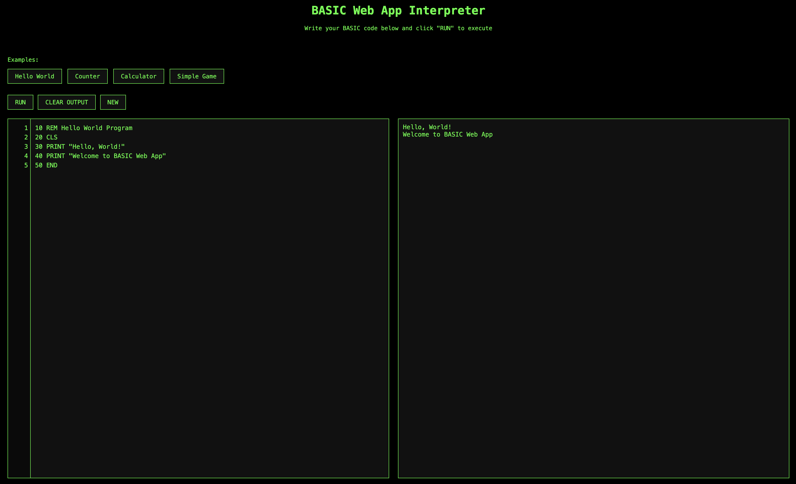

# BasicScript: A Retro BASIC Web Interpreter



BasicScript is a browser-based BASIC language interpreter that brings the nostalgic experience of early computing to the modern web. Write and run BASIC code directly in your browser with the classic green-on-black terminal aesthetic.

## Features

- **Authentic BASIC Experience**: Classic BASIC syntax with line numbers
- **Interactive Editor**: Write code with line numbers and syntax highlighting
- **Built-in Examples**: Pre-loaded example programs to get started
- **Terminal-style Output**: Classic green-on-black console display
- **No Server Required**: Runs entirely in the browser

## Supported BASIC Commands

BasicScript supports essential BASIC commands including:

- `PRINT` - Display text and values
- `LET` - Assign values to variables
- `IF/THEN/ELSE` - Conditional statements
- `GOTO` - Jump to a specific line number
- `INPUT` - Get user input
- `CLS` - Clear the screen
- `REM` - Add comments to your code
- `END` - End program execution

Plus built-in functions:
- `RND()` - Generate random numbers
- `INT()` - Convert to integer
- `VAL()` - Convert strings to numbers

## Usage

1. Open `index.html` in any modern browser
2. Write your BASIC code in the editor (with line numbers)
3. Click "RUN" to execute your code
4. See the output in the right panel
5. Try the example programs using the buttons at the top

## Example Programs

### Hello World
```basic
10 REM Hello World Program
20 CLS
30 PRINT "Hello, World!"
40 PRINT "Welcome to BasicScript"
50 END
```

### Counter
```basic
10 REM Counter Program
20 CLS
30 LET count = 0
40 PRINT "Counter value: "; count
50 LET count = count + 1
60 IF count <= 10 THEN GOTO 40
70 PRINT "Counter finished!"
80 END
```

### Calculator
```basic
10 REM Simple Calculator
20 CLS
30 INPUT "Enter first number: "; A
40 IF A = "" THEN PRINT "Calculator cancelled.": END
50 LET A = VAL(A)
60 INPUT "Enter second number: "; B
70 IF B = "" THEN PRINT "Calculator cancelled.": END
80 LET B = VAL(B)
90 PRINT "Sum: "; A + B
100 PRINT "Difference: "; A - B
110 PRINT "Product: "; A * B
120 PRINT "Division: ";
130 IF B <> 0 THEN PRINT A / B ELSE PRINT "Cannot divide by zero"
140 END
```

### Number Guessing Game
```basic
10 REM Number Guessing Game
20 CLS
30 LET secret = INT(RND() * 10) + 1
40 LET tries = 0
50 PRINT "I'm thinking of a number between 1 and 10"
60 INPUT "Your guess: "; guess
70 IF guess = "" THEN PRINT "Game cancelled.": END
80 LET guess = VAL(guess)
90 LET tries = tries + 1
100 IF guess < secret THEN PRINT "Too low!": GOTO 60
110 IF guess > secret THEN PRINT "Too high!": GOTO 60
120 PRINT "Correct! You got it in "; tries; " tries."
130 END
```

## Installation

No installation required! Just clone the repository and open `index.html` in any modern browser.

```bash
git clone https://github.com/trentmillar/basicscript.js
cd basicscript.js
# Open index.html in your browser
```

## Extending BasicScript

Want to add more BASIC commands or functions? The interpreter is modular and easy to extend:

1. Add new command handling in the `executeLine` function
2. Create a new `executeYourCommand` method in the `BASICInterpreter` class
3. Update the syntax highlighting if needed

## Contributing

Contributions are welcome! Feel free to submit a pull request to add features or fix bugs.

1. Fork the repository
2. Create your feature branch (`git checkout -b feature/amazing-feature`)
3. Commit your changes (`git commit -m 'Add some amazing feature'`)
4. Push to the branch (`git push origin feature/amazing-feature`)
5. Open a Pull Request

## License

This project is licensed under the MIT License - see the LICENSE file for details.

## Acknowledgments

- Inspired by the BASIC programming language created by John G. Kemeny and Thomas E. Kurtz
- Built with vanilla JavaScript and CSS
- Special thanks to the pioneers of early computing who made programming accessible to everyone

---

Created with 💚 for all BASIC enthusiasts and retro computing fans
